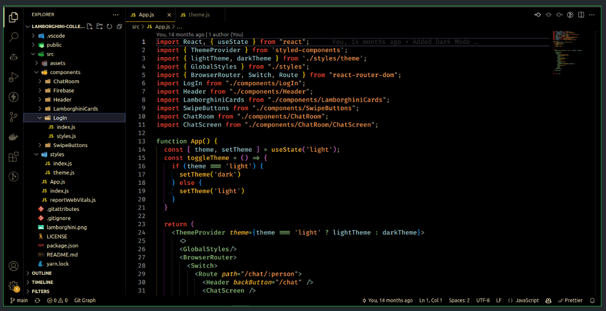

# 🥃 Dark Walker — VSCode Theme



> **Dark theme inspired by the elegance of Johnnie Walker whisky.**  
> A refined dark experience with high contrast, warm tones, and bold JSX highlighting — designed for developers who appreciate both style and clarity.

---

## ✨ Features

- 🖤 **Rich dark palette** with balanced contrast for long coding sessions
- 💛 **Golden and amber accents** inspired by whisky hues
- 🧩 **Bold JSX tags** for improved readability in React and modern frameworks
- 🧠 Carefully tuned for JavaScript, TypeScript, HTML, CSS, and Markdown
- 🎨 Looks stunning in both light-controlled and dark environments

---

## 📦 Installation

1. Open **Visual Studio Code**
2. Go to **Extensions** (`Ctrl+Shift+X` / `Cmd+Shift+X`)
3. Search for **Dark Walker**
4. Click **Install**
5. Open the Command Palette (`Ctrl+K Ctrl+T`) → Choose **Dark Walker**

---

## 🧰 Manual Install (VSIX)

If you prefer a local install:

```bash
vsce package
code --install-extension dark-walker-<version>.vsix
```
