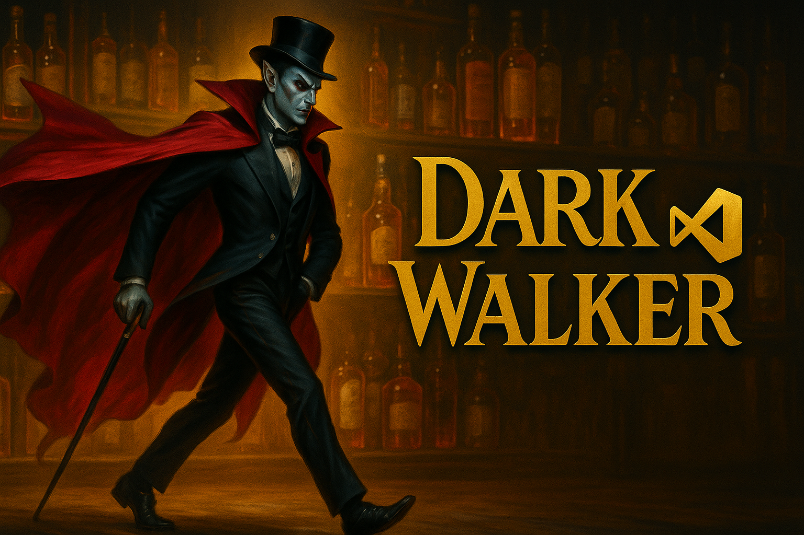

# 🦇 Dark Walker



> **Dark theme inspired by the elegance of a famous scotch whisky.**  
> A refined dark experience with high contrast and sophistication. Keep coding!

---

## ✨ Features

- 🦇 **Rich dark palette** with balanced contrast for long coding sessions.
- 🎨 **All colors** inspired by the iconic whisky labels.
- 👨‍💻 **Carefully tuned** for JavaScript, TypeScript, HTML, CSS and Markdown languages.
- 🎨 **Color-safe design:** the palette was meticulously calibrated to reduce color confusion and ensure visual harmony, delivering both accessibility and sophistication.

---

## 🥃 Design Principles

Core syntax hierarchy:

- **Base:** whisky black for luxurious canvas.
- **Logic & Control:** whisky red to highlight the idea of ​​danger (primary tier).
- **Data & Values:** whisky gold and oranges for smooth flow and attention (second tier).
- **HTML & JSX:** whisky green for balanced contrast and visual harmony (second tier).
- **Dot Notation:** whisky ruby that accentuates property accessors after a dot (tertiary tier).
- **Comments:** whisky platinum in italics that whispers context without distraction (final tier).

---

## 📦 Installation

1. Open **Visual Studio Code**
2. Go to **Extensions** (`Ctrl+Shift+X` / `Cmd+Shift+X`)
3. Search for **Dark Walker**
4. Click **Install**
5. Open the Command Palette (`Ctrl+K Ctrl+T`) → Choose **Dark Walker**

---

## 🧰 Manual Install (VSIX)

If you prefer a local install:

```bash
vsce package
code --install-extension dark-walker-<version>.vsix
```
